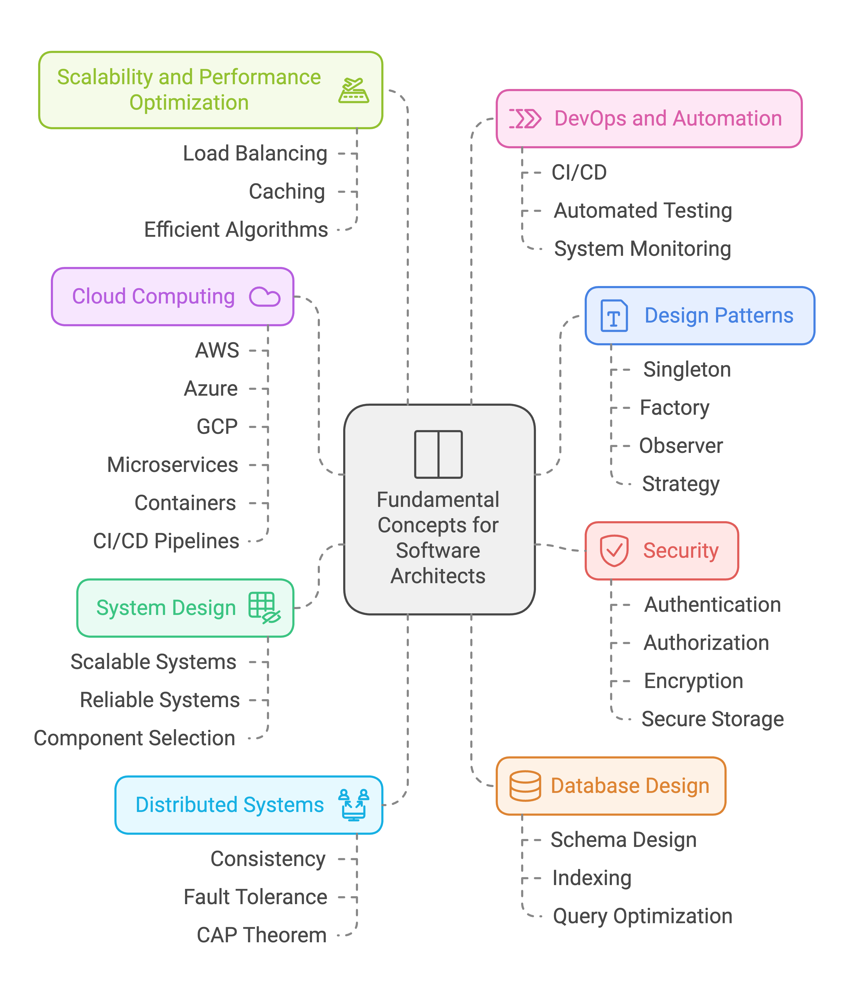
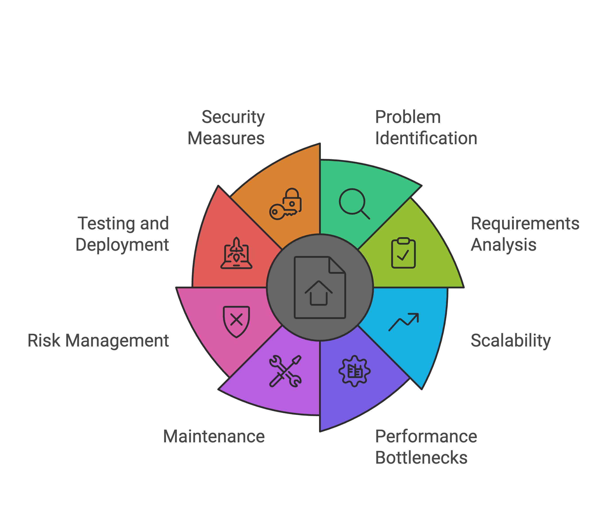

# Software Architure

## Table of Contents
- [Introduction](#introduction)
- [Why? Student Perspectives](#why-to-learn-software-architecture-student-perspectives)
- [Why? Developer Perspectives](#why-to-learn-software-architechture-developer-perspectives)

- [Fundamental Concepts](#fundamental-concepts-needed-to-be-a-software-architect)
- [How a Software Architect Thinks of a Software System aligning with Business](#how-a-software-architecht-thinks-about-a-software-system-aligning-with-business)
- [Critical Questions Software Architect Might Ask](#critical-questions-software-architect-might-ask)
- [Critical Considerations](#critical-considerations)
- [Case Solving](#case-solving)
## Introduction
Software architecture is the high-level design of a software system, outlining its components and how they interact. It acts as a blueprint for building and maintaining the system, helping to organize and structure the software’s parts, like modules and services, and how they connect with other systems.

A good software architecture ensures that the system is scalable, maintainable, secure, and flexible. It focuses on how a system’s components work together to fulfill both functional and non-functional requirements, such as performance, security, and usability. Key aspects of software architecture include:
- **Components**: The individual modules, classes, or services that make up the system.
- **Interfaces**: How these components communicate with each other.
- **Patterns**: Standardized solutions to common problems (e.g., layered architecture, microservices).
- **Quality Attributes**: Non-functional requirements such as scalability, performance, security, and maintainability.

## Why to learn Software Architecture (Student Perspectives)

### Foundation for Real-World Systems
While programming focuses on algorithms and individual problems, real-world systems require careful planning, design, and coordination. Learning software architecture helps to find out the transition from solving individual problems to creating robust, scalable systems.
### Critical Thinking and Problem Solving
Develops critical thinking skills when learning software architecture. Consider factors like scalability, performance, and fault tolerance when designing systems. These problem-solving abilities are transferable to other areas of computer science and engineering.
### Interdisciplinary Knowledge
Software architecture ties together many topics within computer science, such as algorithms, data structures, networking, databases, and systems programming. Understanding how these topics integrate into a complete system gives learners a holistic view of software development.

## Why to learn Software Architechture (Developer Perspectives)

### Improved Code Quality and Maintainability
Software Architecture define a clear structure for the system, this makes codebase easier to understand, maintain and scale. With proper understanding of software architectural planning, a developer can avoid tight coupling and dependency problems, which may complex the debug and troubleshoot process.
### Better Problem Solving
When developers practice software architecture, they learn to think ahead, anticipate problems, and design solutions that address both immediate and future needs. This forward-thinking approach improves their problem-solving skills.
### Scalability and Performance
Good software architecture ensures that a system can handle increased load and performance requirements over time. Developers who understand architectural principles can make informed decisions that optimize performance and scalability from the beginning.
### Reduced Technical Debt
Without a solid architectural foundation, systems can quickly become difficult to maintain. This leads to technical debt, where the system’s structure becomes so tangled that it’s costly to make changes. By practicing software architecture, developers can avoid accumulating such debt.

### Collaboration and Communication
A developer who understands the software architecture can communicate more effectively with other developers, product owners, and stakeholders. This alignment ensures that the development process is smoother and more efficient.

## Fundamental Concepts needed to be a Software Architect

### Design Patterns 
   - Common solutions to recurring design problems.  
   - Examples: Singleton, Factory, Observer, Strategy.  
   - Helps create efficient and maintainable designs.  

### System Design 
   - Focus on designing components and their interactions.  
   - Teaches how to build scalable and reliable systems.  
   - Guides the choice of suitable components for specific needs.  

### Distributed Systems
   - Deals with systems spread across multiple servers.  
   - Key concepts: consistency, fault tolerance, CAP theorem.  
   - Essential for creating systems that can handle large-scale operations.  

### Cloud Computing 
   - Knowledge of cloud platforms like AWS, Azure, or GCP.  
   - Includes tools like microservices, containers, and CI/CD pipelines.  
   - Prepares students to design cloud-based systems.  

### Database Design
   - Understanding relational and non-relational databases.  
   - Topics include schema design, indexing, and query optimization.  
   - Ensures performance and scalability of data storage.  

### Security 
   - Covers authentication, authorization, encryption, and secure storage.  
   - Key to designing systems that protect data and prevent breaches.  

### Scalability and Performance Optimization  
   - Techniques like load balancing, caching, and efficient algorithms.  
   - Focuses on designing systems that grow with demand.  
   - Ensures performance under high loads.  

### DevOps and Automation
   - Includes CI/CD, automated testing, and system monitoring.  
   - Essential for smooth software deployment and operation.  
   - Helps integrate development and operations for better efficiency.  

## How a software architecht thinks about a Software System aligning with Business
### Aligning with Business Goals
- Understands business needs like user experience, revenue, and market trends.
- Designs systems that efficiently support these objectives.
### Balancing Trade-offs
- Makes decisions by weighing cost, scalability, performance, and complexity.
- Balances priorities like maintainability vs. performance or speed vs. stability.
### Focusing on Long-Term Vision
- Plans for system growth and future changes in business or technology.
- Designs flexible systems to adapt over time.
### Collaborating with Stakeholders
- Works with business leaders, developers, and product managers.
- Translates business needs into technical solutions, ensuring alignment.

## Critical Questions Software Architect Might Ask

- What problem are we solving?
- What are the functional and non-functional requirements?
- How will the system scale with traffic, users, and data?
- What parts of the system might slow down under load?
- How will the system be updated and maintained over time?
- What are the risks, and how will they be managed?
- How will the system be tested and deployed?
- What are the key security measures for data and access?

## Critical Considerations

## Case Solving
- [Week-1](./week-1/README.md)

## References
- [https://martinfowler.com/](https://martinfowler.com/)
- [Youtube Playlist by ](https://www.youtube.com/playlist?list=PL4JxLacgYgqTgS8qQPC17fM-NWMTr5GW6)